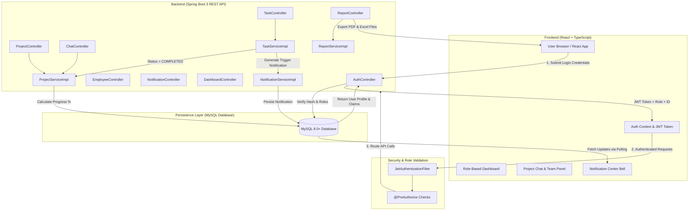

# Smart Employee & Project Management System

A full-stack, enterprise-grade **Project & Employee Management Portal** built using **Spring Boot 3 (Java 25)**, **Spring Security with JWT**, **MySQL**, and a modern **React (TypeScript)** frontend with **Vite** and **Tailwind CSS**.

---

## 📸 System Interface Showcase

### 1. System Architecture & Work Flowchart


---

### 2. Authentication & Access Control
The application features role-based access control with distinct Admin and Employee login flows and JWT authentication.

| Login Screen | User Registration |
| :---: | :---: |
|  |  |

---

### 3. Role-Based Dashboards

#### 👑 Admin Operations Console
Overview of organizational KPIs, active vs completed project metrics, task completion distributions, and quick navigation shortcuts.


#### 🧑‍💻 Employee Workload Console
Personalized workload dashboard displaying assigned projects with dynamic progress bars, pending tasks, upcoming deadlines, and real-time notification feeds.


---

### 4. Core Management Modules

#### 👥 Employee Directory & Profile Management (Admin Only)
Comprehensive employee roster with department, designation, salary, phone, joining date, and status management.


#### 📁 Project Management & Dynamic Progress Tracking
Project portfolio view featuring real-time, dynamic completion progress bars calculated automatically as `(Completed Tasks / Total Tasks) * 100`.


#### 📝 Task Tracking & Status Workflows
Task list with priority badges, deadlines, employee assignment tags, and quick actions for updating task progress and status.


#### 💬 Project Team Chat & Collaboration Room
Project-specific chat room with team member roster, profile cards, auto-polling message synchronization, and member ownership checks.


#### 📊 Analytics & Automated Reports (Admin Only)
Departmental breakdowns, employee statistics, and downloadable **PDF** & **Excel** report exports.


---

## 🔀 System Workflow Diagram



---

## ✨ Features Highlight

* **Role-Based Access Control (RBAC)**:
    * **Admin**: Complete access to Employee Directory, Project Management, Task Allocation, Reports, System Notifications, and Data Exports.
    * **Employee**: Restricted to assigned Projects, assigned Tasks, Project Team Chat, and personal Notifications.
* **Automatic Database Initialization & Seeding**:
    * On initial startup, `DatabaseSeeder.java` populates 1 System Administrator account and 20+ departmentally distributed employees (HR, IT, Backend, Frontend, QA, DevOps) along with sample projects and tasks.
* **Dynamic Project Progress Calculation**:
    * Project progress (%) is dynamically calculated in the backend formula:
      $$\text{Progress} = \left( \frac{\text{Completed Tasks}}{\text{Total Tasks}} \right) \times 100$$
* **Real-Time Notification Center**:
    * Bell icon with unread counter badge. Automatic notifications triggered upon Task Completion, Task Assignment, Project Creation, and Team Assignment.
* **Project Team Chat Room**:
    * Dedicated team chat room for each project with real-time message polling, team member roster, and member profile summaries.
* **Automated PDF & Excel Report Exports**:
    * One-click generation of organizational reports formatted in **PDF** (via OpenPDF) and **Excel** (via Apache POI), including employee rosters, project progress metrics, and pending task lists.
* **OpenAPI 3.0 & Interactive Swagger UI**:
    * Complete interactive REST API documentation with built-in JWT Bearer token authentication testing support.

---

## 📖 API Documentation & Swagger UI

The backend includes full **OpenAPI 3.0** documentation integrated via Springdoc OpenAPI UI (`SwaggerConfig.java`).

### 🔗 Swagger Endpoints
* **Interactive Swagger UI**: [`http://localhost:8080/swagger-ui/index.html`](http://localhost:8080/swagger-ui/index.html) (or [`http://localhost:8080/swagger-ui.html`](http://localhost:8080/swagger-ui.html))
* **OpenAPI Spec (JSON)**: [`http://localhost:8080/v3/api-docs`](http://localhost:8080/v3/api-docs)

### 🔐 How to Authenticate in Swagger UI
1. Open [`http://localhost:8080/swagger-ui/index.html`](http://localhost:8080/swagger-ui/index.html) in your browser.
2. Locate the `POST /login` endpoint under **AuthController**.
3. Click **Try it out** and enter credentials:
   ```json
   {
     "email": "admin@company.com",
     "password": "Admin@123",
     "loginType": "ADMIN"
   }
   ```
4. Execute the request and copy the returned `token` string from the JSON response.
5. Click the **"Authorize" 🔓** button located at the top right of the Swagger UI page.
6. Enter `Bearer <YOUR_JWT_TOKEN>` (or paste your token directly into the `bearerAuth` field) and click **Authorize**.
7. All subsequent API calls made in Swagger UI will now automatically pass the `Authorization: Bearer <token>` header!

---

## 🛠️ Technology Stack

| Layer | Technologies Used |
| :--- | :--- |
| **Backend Framework** | Java 25, Spring Boot 3.4.1, Spring Data JPA, Spring Security |
| **API Documentation** | OpenAPI 3.0, Springdoc OpenAPI UI 3.0 / Swagger UI |
| **Authentication** | JWT (JSON Web Tokens), BCrypt Password Hashing |
| **Reporting & Export** | Apache POI (Excel `.xlsx`), OpenPDF (PDF `.pdf`) |
| **Database** | MySQL 8.0+ |
| **Frontend Framework** | React 18, TypeScript, Vite |
| **Styling & Icons** | Vanilla CSS Design System, Lucide React Icons |
| **Charts & Visualization**| Recharts |
| **Build & Container Tools** | Apache Maven, Node.js / npm, Docker & Docker Compose |

---

## 🔑 Pre-Seeded Default Credentials

All accounts come pre-configured via `DatabaseSeeder.java`.

### 1. System Administrator
* **Email**: `admin@company.com`
* **Password**: `Admin@123`
* **Role**: `ADMIN`

### 2. Sample Employee Accounts
> **Password for ALL employees**: `Employee@123`

| Department | Email Address | Role / Designation |
| :--- | :--- | :--- |
| **Backend** | `backend1@company.com` | Senior Backend Developer |
| **Backend** | `backend2@company.com` | Java Developer |
| **Frontend** | `frontend1@company.com` | React Developer |
| **Frontend** | `frontend2@company.com` | Frontend Engineer |
| **IT** | `it1@company.com` | IT Support Specialist |
| **HR** | `hr1@company.com` | HR Specialist |

---

## 📡 REST API Reference

| Module | Method | Endpoint | Access / Role | Description |
| :--- | :---: | :--- | :---: | :--- |
| **Auth** | `POST` | `/login` | Public | Authenticate user (Admin or Employee) and receive JWT token |
| **Auth** | `POST` | `/register` | Public | Register new employee user account |
| **Dashboard** | `GET` | `/api/dashboard/admin` | `ADMIN` | Fetch overall KPIs, project completion rates, and task metrics |
| **Dashboard** | `GET` | `/api/dashboard/employee/{id}` | `ADMIN`, `EMPLOYEE` | Fetch employee workload summary and pending tasks |
| **Employees** | `GET` | `/api/employees` | `ADMIN` | List all employees with pagination (`page`, `size`) |
| **Employees** | `GET` | `/api/employees/{id}` | `ADMIN` | Get specific employee profile by ID |
| **Employees** | `POST` | `/api/employees` | `ADMIN` | Create new employee record |
| **Employees** | `PUT` | `/api/employees/{id}` | `ADMIN` | Update employee information |
| **Employees** | `DELETE` | `/api/employees/{id}` | `ADMIN` | Delete employee record |
| **Projects** | `GET` | `/api/projects` | `ADMIN` | List all projects in organization |
| **Projects** | `GET` | `/api/employee/projects` | `EMPLOYEE` | List projects assigned to logged-in employee |
| **Projects** | `POST` | `/api/projects` | `ADMIN` | Create project & assign employee team members |
| **Projects** | `PUT` | `/api/projects/{id}` | `ADMIN` | Update project details and assigned team |
| **Tasks** | `GET` | `/api/employee/tasks` | `EMPLOYEE` | Get tasks assigned to logged-in employee |
| **Tasks** | `PUT` | `/api/tasks/{id}/status` | `EMPLOYEE`, `ADMIN` | Update task status (`PENDING`, `IN_PROGRESS`, `COMPLETED`) |
| **Tasks** | `PUT` | `/api/tasks/{id}/progress` | `EMPLOYEE`, `ADMIN` | Update task percentage progress (0-100%) |
| **Notifications**| `GET` | `/api/notifications` | `EMPLOYEE`, `ADMIN` | Fetch list of personal notifications |
| **Notifications**| `GET` | `/api/notifications/unread-count` | `EMPLOYEE`, `ADMIN` | Get count of unread notifications |
| **Notifications**| `PUT` | `/api/notifications/{id}/read` | `EMPLOYEE`, `ADMIN` | Mark specific notification as read |
| **Team Chat** | `GET` | `/api/projects/{id}/chat` | Team Members | Get project chat message history |
| **Team Chat** | `POST` | `/api/projects/{id}/chat` | Team Members | Send message to project chat room |
| **Team Chat** | `GET` | `/api/projects/{id}/team` | Team Members | Get list of assigned team members for project |
| **Reports** | `GET` | `/api/reports/employee` | `ADMIN` | Get departmental breakdown and employee metrics |
| **Reports** | `GET` | `/api/reports/projects` | `ADMIN` | Get project progress report overview |
| **Reports** | `GET` | `/api/reports/tasks/pending` | `ADMIN` | Get list of all pending tasks across projects |
| **Reports** | `GET` | `/api/reports/pdf` | `ADMIN` | Export full organizational report as **PDF** document |
| **Reports** | `GET` | `/api/reports/excel` | `ADMIN` | Export full organizational report as **Excel** spreadsheet |

---

## 🚀 Setup & Installation Instructions

### Prerequisites
Ensure you have the following installed on your system:
* **Java Development Kit (JDK 17+)** (Configured for Java 25 / 17+)
* **Node.js (v18+) & npm**
* **MySQL Server (v8.0+)**
* **Git**

---

### Step 1: Database Setup (MySQL)

1. Open your MySQL client (MySQL Workbench, TablePlus, or MySQL CLI).
2. Execute the provided [`database_schema.sql`](file:///d:/Employee%20Management/database_schema.sql) file located in the root directory:

```bash
mysql -u root -p < database_schema.sql
```

Alternatively, open MySQL Workbench and execute the script to create the `employee_management` database and required tables.

---

### Step 2: Backend Configuration & Launch (Spring Boot)

1. Navigate to the backend directory:
   ```bash
   cd employee-management-backend
   ```
2. Open [`src/main/resources/application.properties`](file:///d:/Employee%20Management/employee-management-backend/src/main/resources/application.properties) and update your MySQL credentials:
   ```properties
   spring.datasource.url=jdbc:mysql://localhost:3306/employee_management
   spring.datasource.username=root
   spring.datasource.password=YOUR_MYSQL_PASSWORD
   spring.jpa.hibernate.ddl-auto=update
   ```
3. Run the Spring Boot application using Maven:
   ```bash
   mvn spring-boot:run
   ```
   *The backend server will start on `http://localhost:8080`.*

#### ⚙️ Configurable Environment Variables

The backend supports the following environment variable overrides:

| Variable | Default Value | Description |
| :--- | :--- | :--- |
| `SPRING_DATASOURCE_URL` | `jdbc:mysql://localhost:3306/employee_management` | Database JDBC URL |
| `SPRING_DATASOURCE_USERNAME` | `root` | MySQL user |
| `SPRING_DATASOURCE_PASSWORD` | `pandu@123` | MySQL password |
| `SERVER_PORT` | `8080` | Backend REST server port |
| `JWT_SECRET` | `MySuperSecretKeyForEmployeeManagement...` | Secret key for signing JWT tokens |
| `JWT_EXPIRATION` | `86400000` (24 Hours in ms) | Token validity duration |

---

### Step 3: Frontend Configuration & Launch (React / Vite)

1. Open a new terminal and navigate to the frontend directory:
   ```bash
   cd employee-management-frontend
   ```
2. Install all dependencies:
   ```bash
   npm install
   ```
3. Start the Vite development server:
   ```bash
   npm run dev
   ```
   *The application will open on `http://localhost:5173`.*

---

## 🐳 Docker Setup

You can run the complete application (MySQL, Spring Boot Backend, and React Frontend) using Docker Compose.

### Prerequisites
- Docker Desktop
- Docker Compose

### Start the application

```bash
docker compose up --build
```

### Access the application

| Service | URL | Description |
|---------|-----|-------------|
| **Frontend UI** | `http://localhost:5173` | React TypeScript Dashboard |
| **Backend API** | `http://localhost:8080` | Spring Boot REST API |
| **Swagger UI** | `http://localhost:8080/swagger-ui/index.html` | Interactive API Documentation |
| **OpenAPI Spec** | `http://localhost:8080/v3/api-docs` | JSON API Specification |
| **MySQL Database** | `localhost:3307` | Containerized MySQL 8.0 Server |

### Stop the application

```bash
docker compose down
```

### Remove containers and database volume

```bash
docker compose down -v
```

---

## 📬 Postman API Testing

A complete Postman collection is included in the project root:
📄 [`Employee_Management_System.postman_collection.json`](file:///d:/Employee%20Management/Employee_Management_System.postman_collection.json)

### Importing to Postman:
1. Open Postman and click **Import**.
2. Select `Employee_Management_System.postman_collection.json`.
3. The collection contains pre-configured requests grouped into 6 main folders:
    * `01 — Authentication` (Admin Login, Employee Login, Register User)
    * `02 — Employees (Admin Only)` (Get All, Get by ID, Create, Update, Delete)
    * `03 — Projects` (List All, Get Employee Assigned Projects, Create, Update)
    * `04 — Tasks` (Get Employee Tasks, Update Status, Update Progress)
    * `05 — Notifications` (Get User Notifications, Unread Count, Mark Read)
    * `06 — Project Team & Chat` (Get Chat History, Send Message, Get Team Members)

---

## 📁 Repository Structure

```
Employee Management/
├── database_schema.sql                            # MySQL DDL Schema & Data Seed Script
├── docker-compose.yaml                            # Multi-container Docker configuration
├── Employee_Management_System.postman_collection.json  # Postman REST API Collection
├── README.md                                      # Project Documentation & Setup Guide
├── images/                                        # Interface Screenshots & Workflow Diagrams
│   ├── Flow Chart.png
│   ├── Login.png
│   ├── Register.png
│   ├── admin.png
│   ├── employee.png
│   ├── employees.png
│   ├── projects.png
│   ├── Tasks.png
│   ├── Team chat.png
│   └── Reports.png
├── employee-management-backend/                   # Spring Boot 3 Java Application
│   ├── pom.xml
│   └── src/main/java/com/example/employeemanagement/
└── employee-management-frontend/                  # React 18 TypeScript Application
    ├── package.json
    └── src/
```

---

## 📄 License
This project is open source and available under the **MIT License**.
