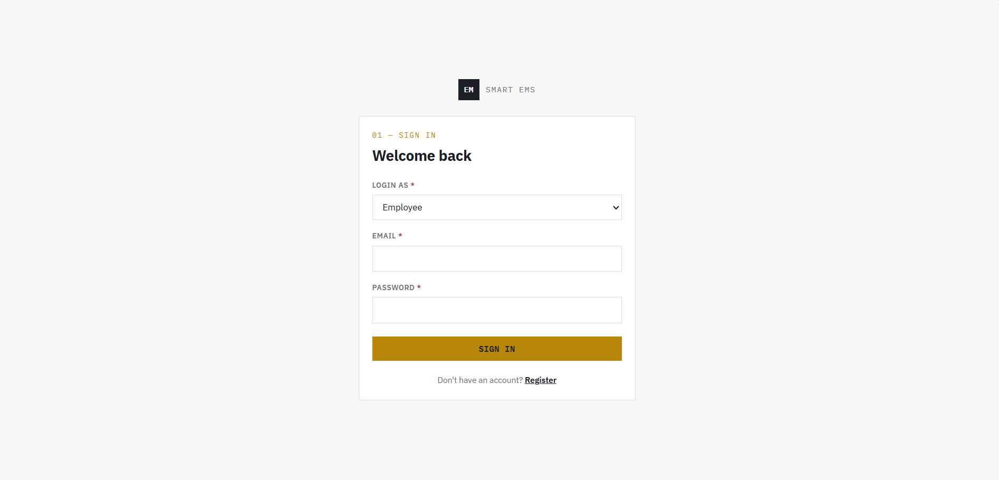
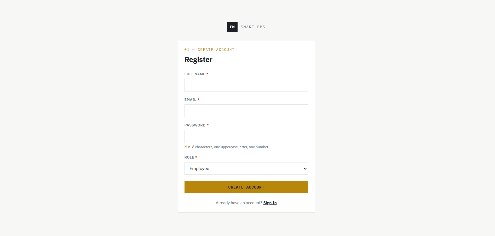
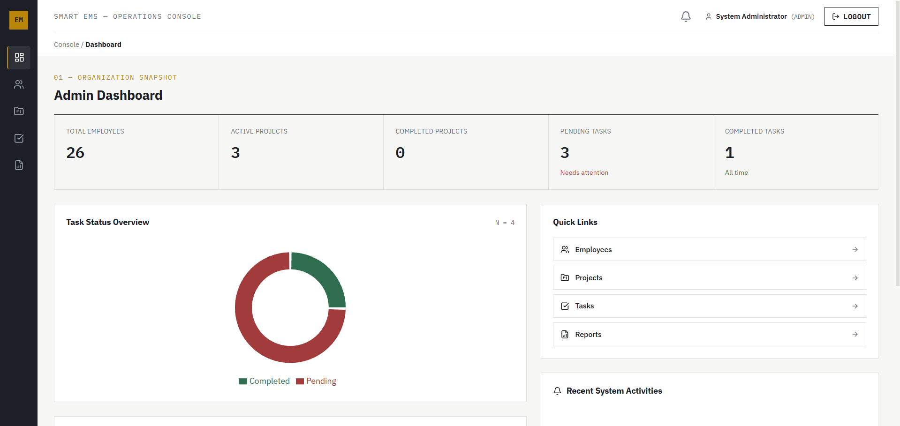
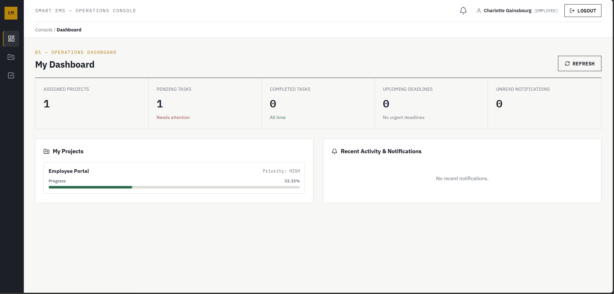
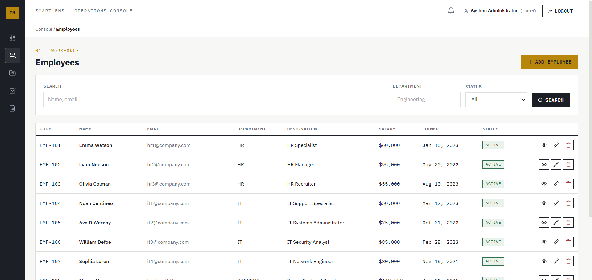
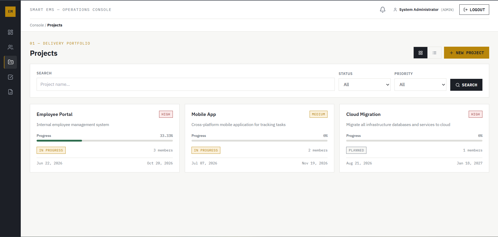
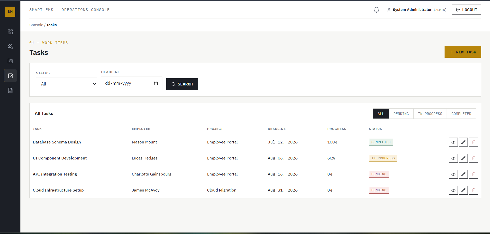
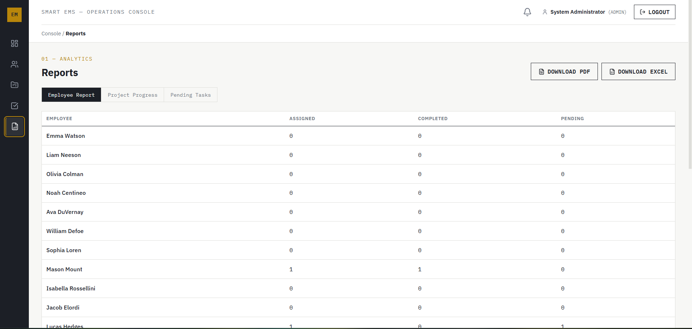

# Smart Employee & Project Management System

A full-stack, enterprise-grade **Project & Employee Management Portal** built using **Spring Boot 3 (Java 25)**, **Spring Security with JWT**, **MySQL**, and a modern **React (TypeScript)** frontend with **Vite** and **Tailwind CSS**.

---

## 📸 System Interface Showcase

### 1. System Architecture & Work Flowchart


---

### 2. Authentication & Access Control
The application features role-based access control with distinct Admin and Employee login flows and JWT authentication.

| Login Screen | User Registration |
| :---: | :---: |
|  |  |

---

### 3. Role-Based Dashboards

#### 👑 Admin Operations Console
Overview of organizational KPIs, active vs completed project metrics, task completion distributions, and quick navigation shortcuts.



#### 🧑‍💻 Employee Workload Console
Personalized workload dashboard displaying assigned projects with dynamic progress bars, pending tasks, upcoming deadlines, and real-time notification feeds.



---

### 4. Core Management Modules

#### 👥 Employee Directory & Profile Management (Admin Only)
Comprehensive employee roster with department, designation, salary, phone, joining date, and status management.



#### 📁 Project Management & Dynamic Progress Tracking
Project portfolio view featuring real-time, dynamic completion progress bars calculated automatically as `(Completed Tasks / Total Tasks) * 100`.



#### 📝 Task Tracking & Status Workflows
Task list with priority badges, deadlines, employee assignment tags, and quick actions for updating task progress and status.



#### 💬 Project Team Chat & Collaboration Room
Project-specific chat room with team member roster, profile cards, auto-polling message synchronization, and member ownership checks.


#### 📊 Analytics & Reports (Admin Only)
Departmental breakdown, employee counts, and distribution reports.



---

## 🔀 System Workflow Diagram

```mermaid
flowchart TD
    subgraph Client ["Frontend (React + TypeScript)"]
        UI[User Browser / React App]
        AuthCtx[Auth Context & JWT Token]
        Dash[Role-Based Dashboard]
        ChatUI[Project Chat & Team Panel]
        NotifCenter[Notification Center Bell]
    end

    subgraph Security ["Security & Role Validation"]
        Filter[JwtAuthenticationFilter]
        PreAuth[@PreAuthorize Checks]
    end

    subgraph Backend ["Backend (Spring Boot 3 REST API)"]
        AuthCtrl[AuthController]
        EmpCtrl[EmployeeController]
        ProjCtrl[ProjectController]
        TaskCtrl[TaskController]
        NotifCtrl[NotificationController]
        ChatCtrl[ChatController]
        
        ProjSvc[ProjectServiceImpl]
        TaskSvc[TaskServiceImpl]
        NotifSvc[NotificationServiceImpl]
    end

    subgraph Database ["Persistence Layer (MySQL Database)"]
        DB[(MySQL 8.0+ Database)]
    end

    UI -->|1. Submit Login Credentials| AuthCtrl
    AuthCtrl -->|Verify Hash & Roles| DB
    DB -->|Return User Profile & Claims| AuthCtrl
    AuthCtrl -->|JWT Token + Role + ID| AuthCtx

    AuthCtx -->|2. Authenticated Requests| Filter
    Filter --> PreAuth
    PreAuth -->|3. Route API Calls| Backend

    ProjCtrl --> ProjSvc
    TaskCtrl --> TaskSvc
    ChatCtrl --> ProjSvc

    TaskSvc -->|Status = COMPLETED| ProjSvc
    ProjSvc -->|Calculate Progress %| DB
    TaskSvc -->|Generate Trigger Notification| NotifSvc

    NotifSvc -->|Persist Notification| DB
    DB -->|Fetch Updates via Polling| NotifCenter
```

---

## ✨ Features Highlight

* **Role-Based Access Control (RBAC)**:
  * **Admin**: Complete access to Employee Management, Project Management, Task Allocation, Reports, and System Notifications.
  * **Employee**: Restricted to assigned Projects, assigned Tasks, Project Team Chat, and personal Notifications.
* **Automatic Database Initialization & Seeding**:
  * On initial startup, `DatabaseSeeder.java` populates 1 System Administrator account and 20+ departmentally distributed employees (HR, IT, Backend, Frontend, QA, DevOps) along with sample projects and tasks.
* **Dynamic Project Progress Calculation**:
  * Project progress (%) is dynamically calculated in the backend formula:
    $$\text{Progress} = \left( \frac{\text{Completed Tasks}}{\text{Total Tasks}} \right) \times 100$$
* **Real-Time Notification Center**:
  * Bell icon with unread counter badge. Automatic notifications triggered upon Task Completion, Task Assignment, Project Creation, and Team Assignment.
* **Project Team Chat Room**:
  * Dedicated team chat room for each project with real-time message polling, team member roster, and member profile summaries.

---

## 🛠️ Technology Stack

| Layer | Technologies Used |
| :--- | :--- |
| **Backend Framework** | Java 25, Spring Boot 3.4.1, Spring Data JPA, Spring Security |
| **Authentication** | JWT (JSON Web Tokens), BCrypt Password Hashing |
| **Database** | MySQL 8.0+ |
| **Frontend Framework** | React 18, TypeScript, Vite |
| **Styling & Icons** | Vanilla CSS Design System, Lucide React Icons |
| **Charts & Visualization**| Recharts |
| **Build Tools** | Apache Maven, Node.js / npm |

---

## 🔑 Pre-Seeded Default Credentials

All accounts come pre-configured via `DatabaseSeeder.java`.

### 1. System Administrator
* **Email**: `admin@company.com`
* **Password**: `Admin@123`
* **Role**: `ADMIN`

### 2. Sample Employee Accounts
> **Password for ALL employees**: `Employee@123`

| Department | Email Address | Role / Designation |
| :--- | :--- | :--- |
| **Backend** | `backend1@company.com` | Senior Backend Developer |
| **Backend** | `backend2@company.com` | Java Developer |
| **Frontend** | `frontend1@company.com` | React Developer |
| **Frontend** | `frontend2@company.com` | Frontend Engineer |
| **IT** | `it1@company.com` | IT Support Specialist |
| **HR** | `hr1@company.com` | HR Specialist |

---

## 🚀 Setup & Installation Instructions

### Prerequisites
Ensure you have the following installed on your system:
* **Java Development Kit (JDK 17+)**
* **Node.js (v18+) & npm**
* **MySQL Server (v8.0+)**
* **Git**

---

### Step 1: Database Setup (MySQL)

1. Open your MySQL client (MySQL Workbench, TablePlus, or MySQL CLI).
2. Execute the provided [`database_schema.sql`](file:///d:/Employee%20Management/database_schema.sql) file located in the root directory:

```bash
mysql -u root -p < database_schema.sql
```

Alternatively, open MySQL Workbench and execute the script to create the `employee_management` database and required tables.

---

### Step 2: Backend Configuration & Launch (Spring Boot)

1. Navigate to the backend directory:
   ```bash
   cd employee-management-backend
   ```
2. Open [`src/main/resources/application.properties`](file:///d:/Employee%20Management/employee-management-backend/src/main/resources/application.properties) and update your MySQL password:
   ```properties
   spring.datasource.url=jdbc:mysql://localhost:3306/employee_management
   spring.datasource.username=root
   spring.datasource.password=YOUR_MYSQL_PASSWORD
   spring.jpa.hibernate.ddl-auto=update
   ```
3. Run the Spring Boot application using Maven:
   ```bash
   mvn spring-boot:run
   ```
   *The backend server will start on `http://localhost:8080`.*

---

### Step 3: Frontend Configuration & Launch (React / Vite)

1. Open a new terminal and navigate to the frontend directory:
   ```bash
   cd employee-management-frontend
   ```
2. Install all dependencies:
   ```bash
   npm install
   ```
3. Start the Vite development server:
   ```bash
   npm run dev
   ```
   *The application will open on `http://localhost:5173`.*

---

## 📬 Postman API Testing

A complete Postman collection is included in the project root:
📄 [`Employee_Management_System.postman_collection.json`](file:///d:/Employee%20Management/Employee_Management_System.postman_collection.json)

### Importing to Postman:
1. Open Postman and click **Import**.
2. Select `Employee_Management_System.postman_collection.json`.
3. The collection contains pre-configured requests for:
   * `01 — Authentication` (Admin Login, Employee Login, Register User)
   * `02 — Employees` (List, Get, Create, Update, Delete)
   * `03 — Projects` (List All, Get Employee Assigned Projects, Create, Update)
   * `04 — Tasks` (Get Employee Tasks, Update Status, Update Progress)
   * `05 — Notifications` (Get Notifications, Unread Count, Mark as Read)
   * `06 — Project Team & Chat` (Get History, Send Message, Get Team)

---

## 📁 Repository Structure

```
Employee Management/
├── database_schema.sql                            # MySQL DDL Schema & Seed Script
├── Employee_Management_System.postman_collection.json  # Postman API Collection
├── README.md                                      # Documentation & Setup Guide
├── images/                                        # Application Screenshots & Diagrams
│   ├── Flow Chart.png
│   ├── Login.png
│   ├── Register.png
│   ├── admin.png
│   ├── employee.png
│   ├── employees.png
│   ├── projects.png
│   ├── Tasks.png
│   ├── Team chat.png
│   └── Reports.png
├── employee-management-backend/                   # Spring Boot 3 Java Application
│   ├── pom.xml
│   └── src/main/java/com/example/employeemanagement/
└── employee-management-frontend/                  # React 18 TypeScript Application
    ├── package.json
    └── src/
```

---

## 📄 License
This project is open source and available under the **MIT License**.
